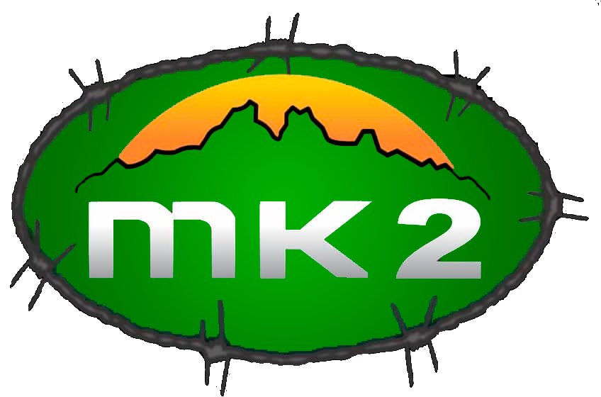
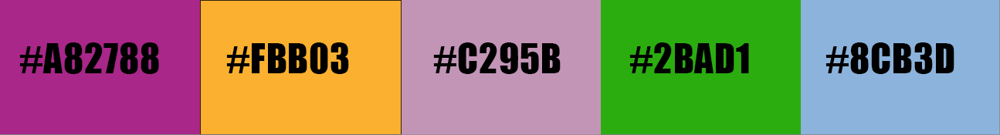

# HACKER - DESAFIO INDIVIDUAL PARTE 1

## Objetivo

Desenvolver um site de vendas responsivo usando apenas HTML, CSS e Bootstrap, tendo como exemplo os players de mercado - Mercado Livre, Submarino, Americanas; cujos entregáveis estão descritos abaixo:

- Página principal com a vitrine dos produtos em destaque. Temos que ter a possibilidade de filtrar o conteúdo por departamento, seção ou categoria de produto.
- Ao clicar em qualquer produto, mostre uma página com os detalhes deste produto (várias fotos, descrição, preço, condições de pagamento, etc)
- Independente da página que esteja sendo exibida, deve haver algum elemento que redirecione para a página com informações institucionais, tipo “quem somos”, “contato”.

## 1ª parte do projeto

- Definição do repositório GIT e Planejamento das estórias/Sprints para execução da tarefa.

## Escopo

A Mk2 é uma empresa voltada para o seguimento Militar, Airsoft, Camping, Uniformes (sob medida) entre outros.

## Histórias do usuário

### Definindo as histórias dos usuários

- História 1: Vitrine Virtual (Pagina inicial).
    - Como cliente eu quero visualizar os produtos disponíveis na loja, bem como seus filtros por categorias e os principais destaques da loja para melhor navegabilidade.
- História 2: Página de Detalhe do Produto.
    - Como cliente eu quero ser direcionado para uma página que contenha demais informações tanto de descrição quanto de formas de pagamento, definições de frete, etc, com o objetivo de melhor estimar o orçamento da compra.
- História 3: Página Institucional.
    - Como cliente eu quero que seja possível acessar a página institucional a partir de qualquer uma das páginas anteriores, a fim de tornar transparente nossos valores, missão, etc.

### Definindo o Backlog do produto

- História 1: prioridade alta
- História 2: prioridade alta
- História 3: prioridade baixa

### Sprints

- Sprint 1: Pesquisa de modelos bootstrap e personalização usando somente HTML e CSS
    - Histórias 1 e 2 

|         Funcionalidades              | Complexidade |   Tempo    |  
|    :----------------------:          | :----------: |   :----:   |  
| Pesquisar modelos adequados           |    fácil     |     3h     | 
| Ajustar estrutura e paleta de cores  |    fácil     |     3h     |
| Ajustar tipografia e layout          |    médio     |     3h     |  
 

- Sprint 2: Ajustar todos os links e navegabilidade
    - Histórias 1 e 2 

|         Funcionalidades                      | Complexidade |   Tempo    |  
|    :----------------------:                  | :----------: |   :----:   |  
| Garantir navegabilbilidade entre as páginas  |    fácil     |     1h     | 
| Aplicar teste de funcionalidades             |    fácil     |     1h     |
| Identar o código                             |    médio     |     3h     | 
| Ajustar responsividade                       |    médio     |     1h     | 

- Sprint 3: Criação da página institucional
    - História 3

|         Funcionalidades                      | Complexidade |   Tempo    |  
|    :----------------------:                  | :----------: |   :----:   |  
| Garantir navegabilbilidade entre as páginas  |    fácil     |     1h     | 
| Aplicar teste de funcionalidades             |    fácil     |     1h     |
| Identar o código                             |    médio     |     3h     | 

Nota:  para esse trabalho me baseei nos trabalhos dos colegas 
    - Pedro Schulz Rangel: https://github.com/PedroSchulzRangel/Gama_Academy_Hacker_Desafio_Individual_1 e
    - Erycson Jose: https://github.com/ErycsonJose/XP-Challenge1

# HACKER - DESAFIO INDIVIDUAL PARTE 2

## Registro das etapas de produção da página
    - Pretende-se, com esta etapa, documentar o passo a passo da criação do site seguindo a ordem das sprints acima definidas.

### 1 - Pesquisa de sites de lojas / associações / instituições que possuem temática relacionada à temática do cliente
    - Imbel https://www.imbel.gov.br/
    - CBC https://www.cbc.com.br/
    - Taurus https://taurusarmas.com.br/

### 2 - Sites bases escolhidos
    - Taurus
    - Imbel

#### Justificativa 
    - A Taurus atualmente ta com uma proposta mais direta, além de possuir uma boa tipografia, enquanto que a Imbel possui várias opções de interação com imagens e texto bem bonitas. Portanto escolhi esses dois entes para basear o meu site.

### 3 - Definindo paleta de cores
    - Respeitando ao máximo as cores já esolhidas previamente na confecção do logo do cliente
    Logo da empresa
   
   `Principais cores`

    `#fbb030`

   `#fb6239`
  
   `#2bad10`

   `#1c700b`

   `#fbfff7`

   `#9c9d9f`

e utilizando a ferramenta  [Adobe Color](https://color.adobe.com/), definimos a paleta de cores registradas abaixo:

### 4 - Definindo Tipografia
#### Fonte principal:
  
  
#### Fonte secundária:
  

#### Fonte auxiliar:
  

### 5 - Estrutura do site

#### Infelizmente não foi possível concluir todas as tasks do desafio. Das solicitadas, tem-se
    - Responsividade
    - Implementação do Bootstrap